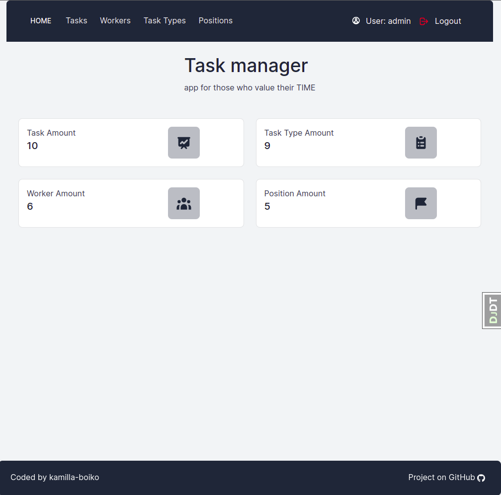
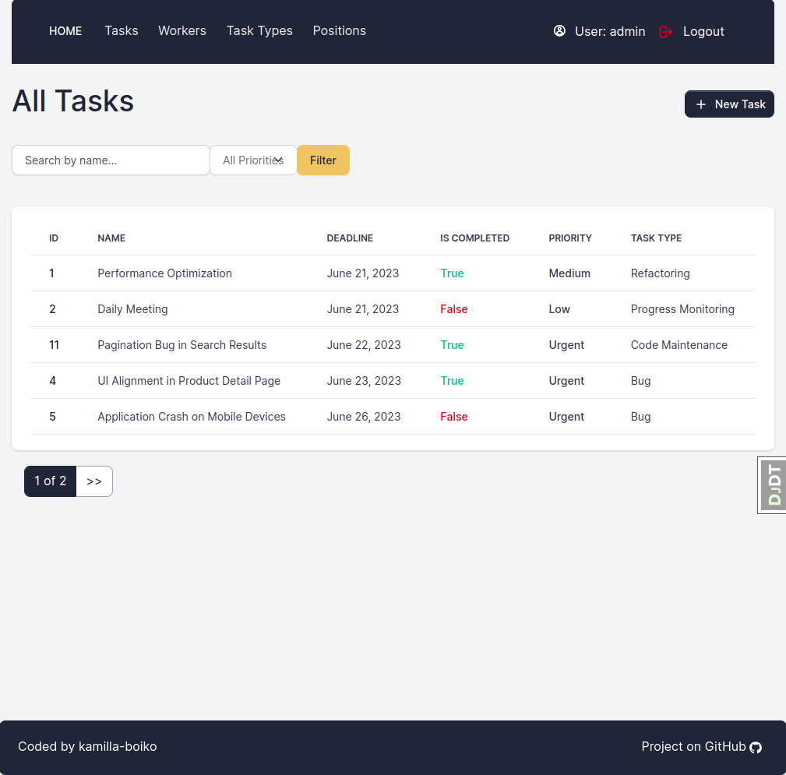

# Task Manager

Django project for managing and handle all possible problems during product development in team

## Check it out!

[Task Manager deployed to Render](https://task-manager-8283.onrender.com/)

### Test User

* Username: Test.User
* Password: User12345

## Installation

Python3 must be already installed

```shell
git clone https://github.com/kamilla-boiko/task-manager.git
cd task-manager
python3 -m venv venv
source venv/bin/activate
pip install -r requirements.txt
python manage.py migrate
python manage.py runserver  # starts Django Server
```

## Features

* Authentication functionality for Worker/User.
* Managing workers, tasks, positions & task types directly from website interface.
* Powerful admin panel for advanced managing.
* For each worker it is shown separately: completed and not completed tasks.
* Validate deadline when create and update Task.
* Filter and Search fields in Task and Worker list pages.

## Environment variables

This project uses environment variables to store sensitive or configurable data.
The variables are stored in a file named .env, which should be created in the
project's root directory.
Please follow the instructions below to set up the environment variables for your local development.

### .env file

Create a file named .env in the root directory of the project and add the following variables
with their corresponding values/
* Note: Make sure to keep the .env file secure and do not commit it to the repository.

### .env_sample file

A file named .env_sample is included in the repository as a template for setting up the .env file.
It contains the names of the environment variables without their values.
You can use it as a reference when creating your own .env file.

## API documentation

To explore the API endpoints, their descriptions, and learn how to interact with the Task Manager application, 
please refer to the API documentation.

The API documentation is available in the task_manager.yaml file, which follows the OpenAPI 3.0.3 specification. 
To access the documentation, follow these steps:

* Locate the task_manager.yaml file in the project repository.
* Open the file using a text editor or an online OpenAPI documentation tool.
* If you prefer a more interactive and user-friendly experience, copy the contents of the task_manager.yaml file 
and paste it into an online OpenAPI editor or Swagger UI.
* Once the documentation is loaded, you will have access to detailed information about the available endpoints, 
their parameters, response formats, and sample requests/responses.

## Demo


